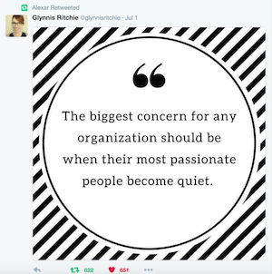
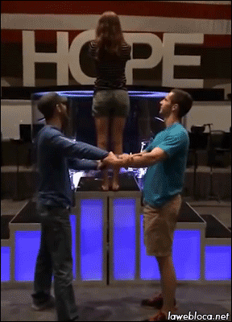
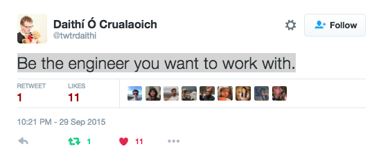

# Keeping the perfect buzz going...

Because may be I’m just nuts but also because to find the balance in a team and to keep a good mental health is not always an easy thing.

- [The problem](#the-problem)

- [The team](#the-team)

- [Individually](#individually)

- [Socially](#socially)

- [References](#references)

- [Acknowledgments](#acknowledgments)

- [License](#license)

## The problem 

- **LACK** of motivation.

- To manage **MOTIVATION** ineffectively so it becomes stressful. 

- Lack of **INSPIRATION**.

This is a collection of reflections that I have recently forgotten and I like to remember from time to time to “keep the perfect buzz going”, not too drunk, not too sober...

## The team

- "Modern software development is performed by **TEAMS** of motivated individuals" - Joseph Pelrine

- "Unless you give motivated **PEOPLE** something **TO BELIEVE IN**, something bigger than their job to work toward, they will motivate themselves to find a new job and you’ll be stuck with whoever’s left." - Simon Sinek

- "The **ENVIRONMENT** is important, just let people choose where to work."

- “It's all about **PEOPLE!**"

- "Ultimately, models are only as good as the people applying them. " - Joseph Pelrine MetaProg GmbH, CHE

## Individually

- “**ALWAYS** have a goal, and keep it in mind. When you reach it, find another one. This will keep you always **MOVING.**"

- "If there is no problems to solve for too long, you are probably in the wrong place, so move and go find problems to solve somewhere else."

- “Every time you are not motionless you are opening a window for a "potential something” to happen even if you don’t know it yet, so **MOVE!**"

- “Talking about doing stuff is good but doing stuff is even better, don’t forget about actually doing real stuff too..."

- “**STIMULATE** your creativity every day as much as possible, do different things, play music, play chess, do sport, socialise, this will help you to see things from a different angle."

- “Do the same things in a different way, brush the teeth with the other hand, read a book upside down, etc, this will help to keep your brain active."

- “Learn as much as you can, but don’t saturate yourself, sometimes it can be counter-productive trying to go too far too fast. It is good to feel you dominate some technique, you need keep your self-esteem high and remember you are good doing what you do."

- "Work less!"

- “Manage your **ENERGY**, not your time.” – Tony Schwartz

- "Believe in your self, time is the most valuable resource, don't waste it."

- "**ASK** for **HELP!**"

- “Do what you **ENJOY**, **ENJOY** what you do."

### Socially

- “Make sure you tell people how good they are frequently enough, and keep the **POSITIVE** feedback going."

- “Socialise, share, smile."

- “Don’t keep it for yourself, **SHOUT!**, **TELL** what you think, **LISTEN**, that’s how the team improves."

- “Sympathise is good but **EMPATHISE** is what will help to build a better group, try to understand and share the feelings of the others.

- "Work alone when you need it but dont't do it constantly, working with **PEOPLE** makes you better."

### References

http://www.metaprog.com/downloads/ECO.pdf 

https://twitter.com

http://www.goodreads.com/quotes/tag/engineering

### Acknowledgments

http://giphy.com/

### License

